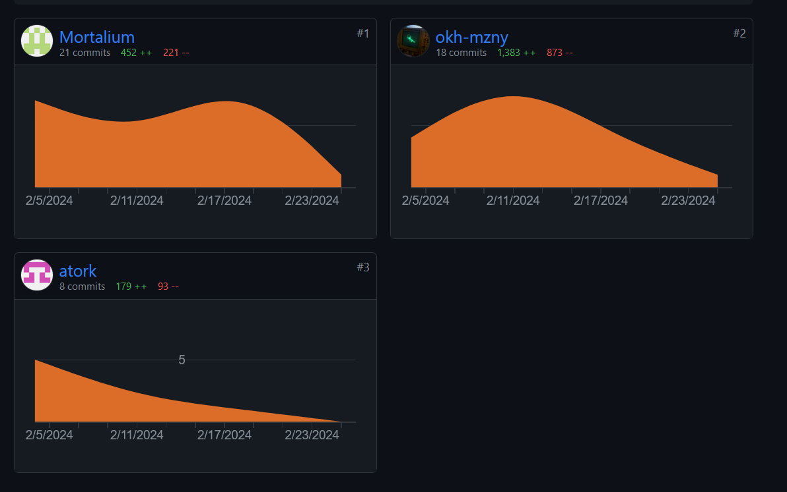
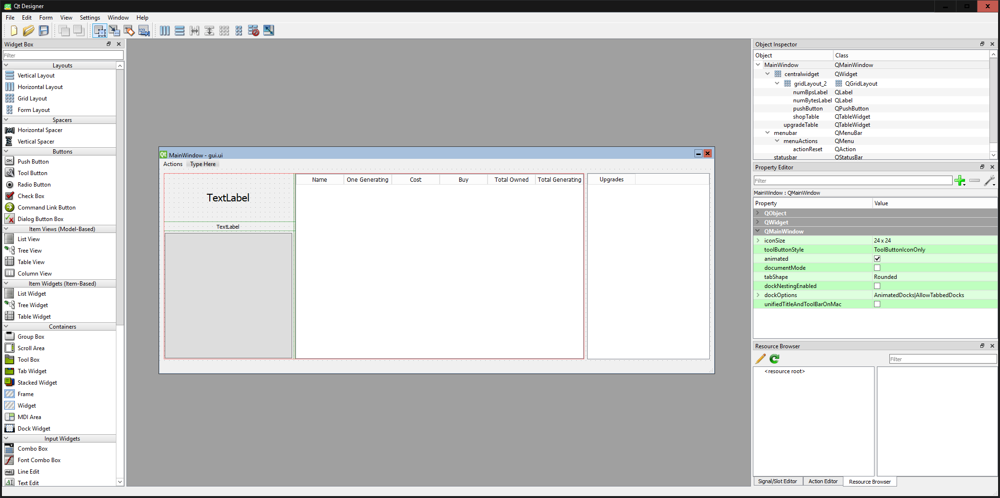
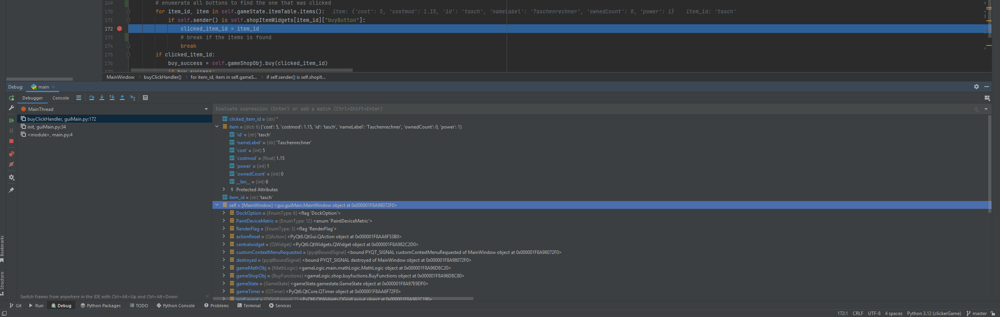

# Grading Criteria Programmieren T3INF1004

## FACHKOMPETENZ (40 Punkte)

### Die Studierenden kennen die Grundelemente der prozeduralen Programmierung. (10)
Siehe gameState.py, buyfunctions.py und mathLogic.py.  

Dort haben wir sehr viel code in functionen ausgelagert,  
die wir mithilfe der Objekte schließlich in anderen Dateien aufrufen können,  
um so den Code schlanker und übersichtlicher zu machen.

### Sie können die Syntax und Semantik von Python (10)

In guiMain.py "prettyPrint()" haben wir mit Integer, Float und String gearbeitet 

In items.py und upgrades.py haben wir dictionaries of dictionaries angelegt mit String-, Float- und Integerwerten,  
die wir in anderen Teilen des Programms abgerufen haben.

### Sie können ein größeres Programm selbständig entwerfen, programmieren und auf Funktionsfähigkeit testen (Das Projekt im Team) (10)

Am Bild kann man so ungefähr sehen, wie wir über die Zeit unser Projekt erstellt haben.

### Sie kennen verschiedene Datenstrukturen und können diese exemplarisch anwenden. (10)

Als Datenstrukturen haben wir hauptsächlich Dictionaries of Dictionaries benutzt. Siehe items.py, upgrades.py und gamestate.py. 
Damit haben wir anfangs Standardwerte definiert, die wir in gameState variabel für den run auch verändern  
und schließlich mit QSettings local abspeichern und wieder aufrufen können. 

## METHODENKOMPETENZ (10 Punkte)

### Die Studierenden können eine Entwicklungsumgebung verwenden um Programme zu erstellen (10)

- Wir haben git für die Sourcecontrol genutzt

- Wir haben Github als Dreh- und Angelpunkt unserer Zusammenarbeit genutzt (https://github.com/okh-mzny/clickerGame)
- Als Umgebungen haben wir VS Code und PyCharm
- Wir haben PyQt6 für die Oberfläche des Spiels genutzt
- Powerpoint zum erstellen unserer Präsentation genutzt

## PERSONALE UND SOZIALE KOMPETENZ (20 Punkte)

### Die Studierenden können ihre Software erläutern und begründen. (5)

Das Spiel ist in der readme.md und in code comments beschrieben.
Wir haben uns gegenseitig unsere Codeideen erklärt und beschrieben

### Sie können existierenden Code analysieren und beurteilen. (5)

https://github.com/dhbwJK23/Escape-Room

Siehe critique.md

### Sie können sich selbstständig in Entwicklungsumgebungen und Technologien einarbeiten und diese zur Programmierung und Fehlerbehebung einsetzen. (10)

Als Framework für die GUI verwenden wir PyQt6, mit dem okh-mzny in der Gruppe bereits Erfahrung hat die er den anderen Gruppenmitgliedern mitteilte.

Qt ist ein verbreitetes GUI- und Programmframework, welches nativ auf vielen verschiedenen Platformen läuft. Darunter Embedded-Systeme wie Autos oder sogar Kaffeemaschinen.

Ein einfacher WYSIWYG-Editor erlaubt schnelles zusammenklicken einer GUI für die Verwendung im Code mittels einer .ui-Datei, die die vollständige Beschreibung der GUI enthält.

Weitere Goodies wie ein abstrahiertes Speichersystem, welches automatisch den besten Speicherort auf dem Betriebssystem für Spieldaten findet und Timerfunktionen für Event-basiertes Programmieren statt einem infinite loop sind ebenso vorhanden.

PyQt6 als Python-Paket ist ein Python Binding an das "richtige" Qt, welches normalerweise mit C++ beschrieben wird.

Für die Fehlerbehebung wurde stark auf den mächtigen eingebauten Debugger in PyCharm gesetzt.

## ÜBERGREIFENDE HANDLUNGSKOMPETENZ (30 Punkte)

### Die Studierenden können eigenständig Problemstellungen der Praxis analysieren und zu deren Lösung Programme entwerfen (30)

