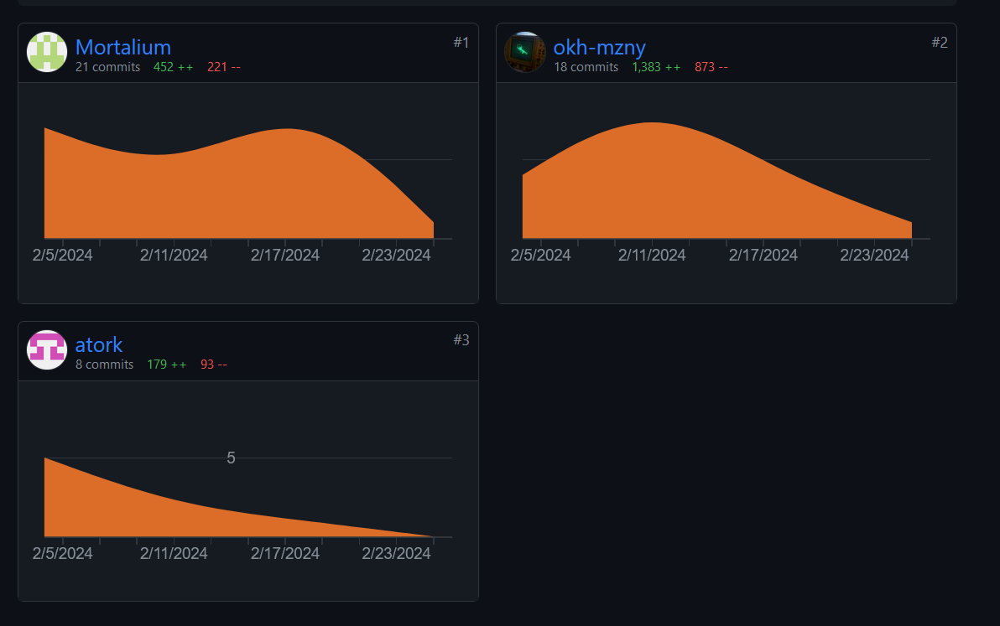

# Grading Criteria Programmieren T3INF1004

## FACHKOMPETENZ (40 Punkte)

### Die Studierenden kennen die Grundelemente der prozeduralen Programmierung. (10)
Siehe gameState.py, buyfunctions.py und mathLogic.py. Dort haben wir seh viel code ausgelagert in functionen, 
die wir mithilfe der Objekte schließlich in anderen Dateien aufrufen können, um so den Code schlanker und übersichtlicher zu machen.

### Sie können die Syntax und Semantik von Python (10)

### Sie können ein größeres Programm selbständig entwerfen, programmieren und auf Funktionsfähigkeit testen (Das Projekt im Team) (10)

### Sie kennen verschiedene Datenstrukturen und können diese exemplarisch anwenden. (10)

## METHODENKOMPETENZ (10 Punkte)

### Die Studierenden können eine Entwicklungsumgebung verwenden um Programme zu erstellen (10)

## PERSONALE UND SOZIALE KOMPETENZ (20 Punkte)

# Die Studierenden können ihre Software erläutern und begründen. (5)

### Sie können existierenden Code analysieren und beurteilen. (5)

### Sie können sich selbstständig in Entwicklungsumgebungen und Technologien einarbeiten und diese zur Programmierung und Fehlerbehebung einsetzen. (10)

## ÜBERGREIFENDE HANDLUNGSKOMPETENZ (30 Punkte)

### Die Studierenden können eigenständig Problemstellungen der Praxis analysieren und zu deren Lösung Programme entwerfen (30)

## Kenntnisse in prozeduraler Programmierung:

### - Algorithmenbeschreibung

### - Datentypen

### - E/A-Operationen und Dateiverarbeitung

### - Operatoren

### - Kontrollstrukturen

### - Funktionen

### - Stringverarbeitung

### - Strukturierte Datentypen
